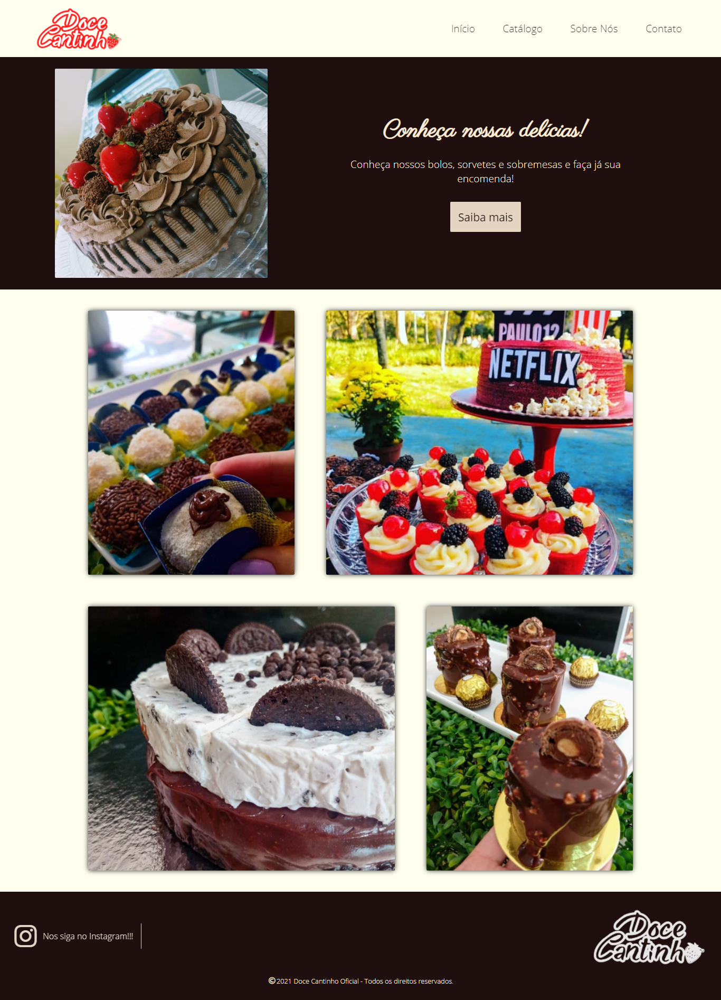

        

    

    <a href="http://fundtestbucket.s3-website.us-east-2.amazonaws.com/#" target="_blank">Oficial site of Doce Cantinho confectionery🍓</a>

# About the project 💡

Final work of the Web Programming subject´s first year from Systems Development technical course, at Etec de São Paulo

<em>Work oriented by professor Carlos Evandro Teruel</em>

#### <strong>Status: </strong>concluded ✔️

# Requirements ❗

- [X] Responsive and static website
- [X] Minimum of 20 HTML pages
- [X] Minimum of 1 page written in English

# Used Technologies 💻

- [X] HTML5
- [X] CSS3 Vanilla
- [X] Google Maps´ JS API

# Final comments 🎂

The work was essential to practice all the learning that have been developed through my first year of frontend studying. With it, I could practice a lot of CSS, including technologies such as flexbox, animations, media queries and pseudo-classes.
I´ve shurely enjoyed all the learning I had and hope to have put it inside this project. 
Intending to start studying JS and Flexbox Grid from now

***
[MIT LICENSE](https://github.com/HenriquePinheiro12/DoceCantinhoOficial/blob/main/LICENSE)
